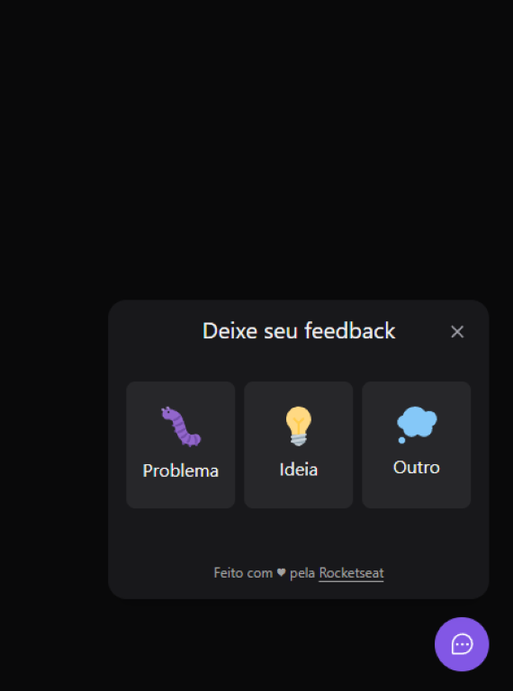
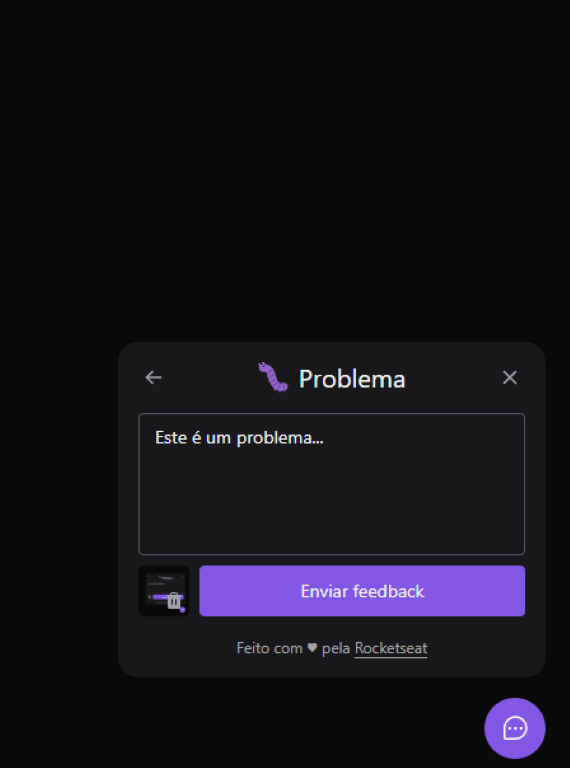
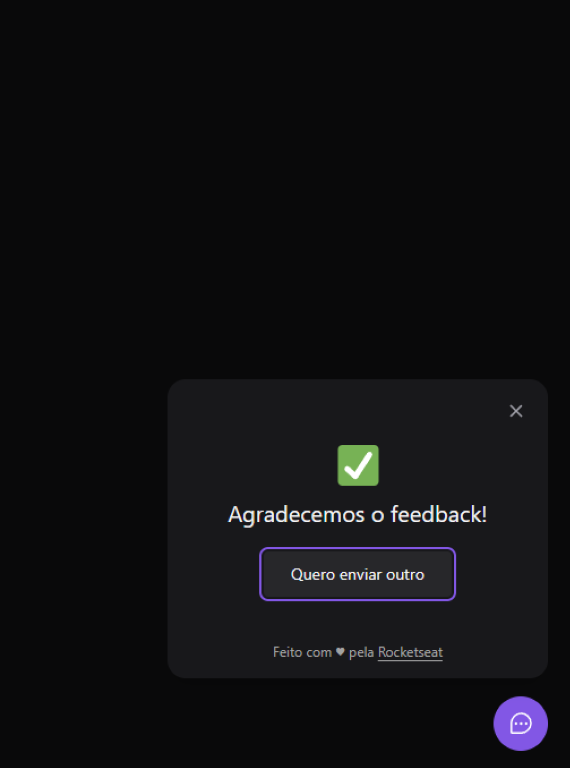

# FeedBack Widget (Feedget)

Widget de feedback desenvolvido durante a semana do NLW Return, 8º edição deste evento da @rocketseat 💜 :rocket:.

## Sobre a aplicação

A aplicação consiste num widget que possibilita o envio de feedbacks além de tirar um screenshot da tela para envio.

## Screenshots

### Desktop App:

  
  
  
  

## Como rodar a aplicação?

**1.** Clone este repositório com o seguinte comando:

`git clone git@github.com:biiah-paixao/nlw-8-impulse-feedget.git`

**2.** Você vai precisar ter o **Node.js** instalado na sua máquina.

> [Como instalar o Node.js](https://nodejs.org/en/). 

**3.** Entre nas duas pastas (web, server) e instale as dependências do projeto de cada uma delas com o comando:

`npm install`

**4.** Crie o arquivo `.env` na raíz do projeto backend na pasta server e adicione a variável de ambiente "DATABASE_URL" com a sua string de conexão do banco de dados PostgreSQL como valor desta variável, em seguida inicie a aplicação com o comando:

`npm run dev`

**5.** Crie o arquivo `.env.local` na raíz do projeto web desktop na pasta web e adicione a variável de ambiente "VITE_API_URL" com a sua url local do backend como valor desta variável (se a porta não tiver sido alterada, o valor inicial será o http://localhost:3333), em seguida inicie a aplicação com o comando:

`npm run dev`

**Isto é tudo! :heart: 
Se você tiver dúvidas sobre o Feedget, você pode perguntar no [GitHub Issues](https://github.com/biiah-paixao/nlw-8-impulse-feedget/issues).**

## Atualização V2 (em breve):

---  

Feito com ❤️ por Beatriz Paixão (gurianaweb) 👋🏽 [Entre em contato!](https://www.linkedin.com/in/beatriz-paixao/)
